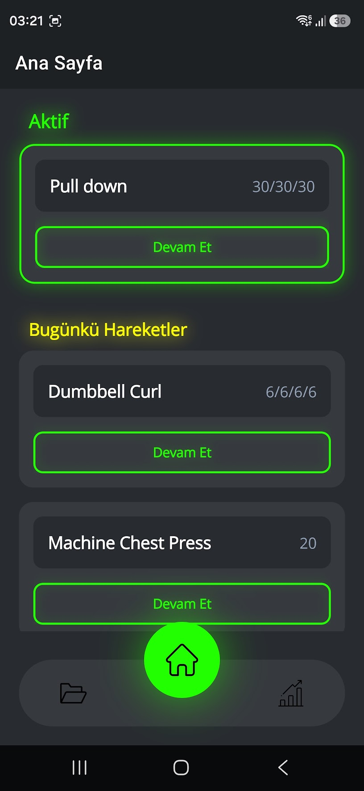
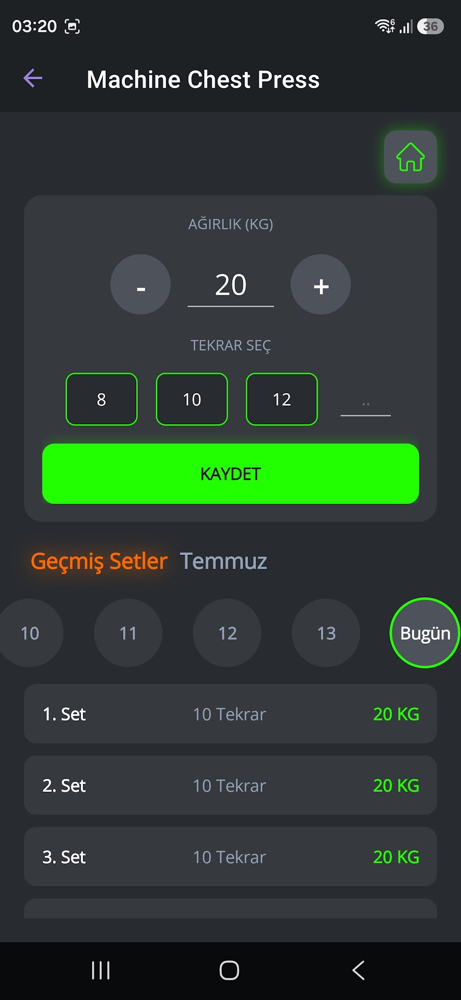
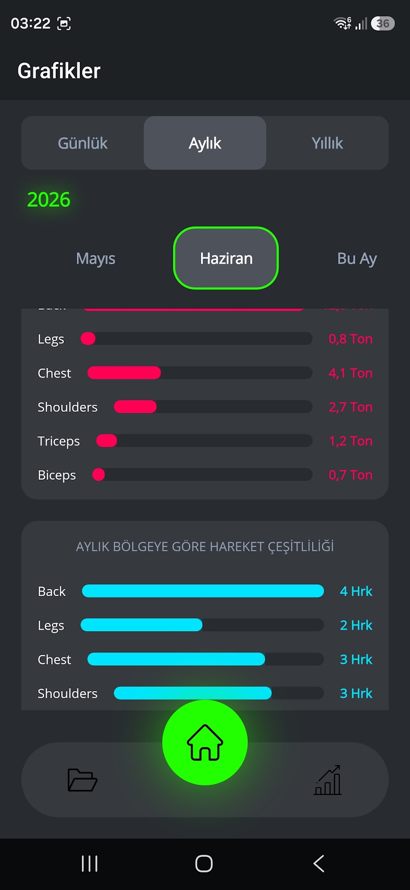
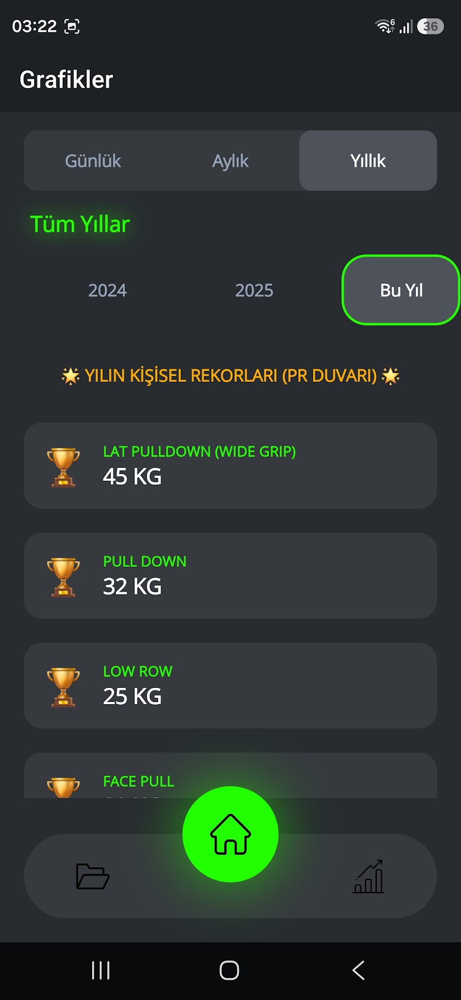

## 📲 Doğrudan İndir (Yükle ve Kullan)

Uygulamayı telefonunuza doğrudan kurmak için cihazınızın işlemci mimarisine uygun olan APK dosyasını indirebilirsiniz:

* 🚀 [Samsung S26 Ultra ve Modern 64-bit Cihazlar İçin APK İndir (arm64)](https://github.com/cagan-karatay/AntrenmanTakipApp/releases/download/v1.3/AntrenmanTakip-v1.3-arm64-ModernCihazlar.apk)
* 📱 [Tecno ve Bütçe Dostu 32-bit Cihazlar İçin APK İndir (arm)](https://github.com/cagan-karatay/AntrenmanTakipApp/releases/download/v1.3/AntrenmanTakip-v1.3-arm-EskiCihazlar.apk)

# 🏋️‍♂️ Antrenman Takip App (Fitness Tracker)

Modern, karanlık/neon temalı ve tamamen performansa odaklı kişisel antrenman takip uygulaması. .NET MAUI ve C# kullanılarak, sıfırdan "Mobile-First" (Önce Mobil) mantığıyla geliştirilmiştir.

Uygulama, spor salonunda kağıt kalem veya karmaşık Excel tabloları kullanma derdine son vererek; setlerinizi, tekrarlarınızı ve kaldırdığınız ağırlıkları milisaniyeler içinde kaydedip grafiksel olarak takip etmenizi sağlar.

## 📸 Ekran Görüntüleri

<p align="center">
  
  
  
  
</p>

## 🚀 Öne Çıkan Yeni Özellikler (v1.3 Büyük Güncellemesi)

Uzun bir geliştirme ve test sürecinin ardından, uygulama mimarisi ve arayüzü baştan aşağı yenilendi!

* **Pürüzsüz UI/UX Animasyonları:** Listelerde yükseklik (Height Cache) kilitlenmelerini çözen, setleri silerken veya düzenlerken yukarıdan aşağı süzülen 60FPS "Native" MAUI animasyonları eklendi.
* **Akıllı APK Parçalama (Architecture Splitting):** Uygulama artık "Fat APK" hantallığından kurtarıldı. Hem modern 64-bit Amiral Gemisi telefonlar (`arm64-v8a`) hem de eski nesil bütçe dostu 32-bit telefonlar (`armeabi-v7a`) için cihaza özel, hafif ve güvenlik duvarlarına takılmayan özel paketleme sistemi kuruldu.
* **Gelişmiş Geçmiş Takibi & SQLite Entegrasyonu:** Geçmiş günlerin verilerine ulaşmak, önceki ayların antrenmanlarına bakmak ve hedeflenen ağırlıkları görmek artık çok daha hızlı ve güvenilir. Zaman çizelgesi (Timeline) sistemi eklendi.
* **Kusursuz Siberpunk Tema:** Microsoft MAUI'nin varsayılan mor teması, sistemin derinliklerinden (Android Status Bar) tamamen kazınarak yerini uygulamanın ruhuna uygun Koyu Gri (`#1e1e1e`) ve Neon Yeşil (`#22ff00`) siberpunk paletine bıraktı.

## 🛠️ Kullanılan Teknolojiler & Mimari

* **Framework:** .NET 10 & .NET MAUI
* **Dil:** C# & XAML
* **Veritabanı:** `sqlite-net-pcl` (Yerel ve Çevrimdışı Depolama)
* **Mimari Yaklaşım:** MVVM tabanlı esnek yapı, Platform Spesifik Derleme Komutları (Condition Blocks).
* **Ekstra:** Native Android `colors.xml` manipülasyonu ve özel `Animation` motorları.

## 💡 Kurulum ve Derleme
Geliştiriciler projeyi klonladıktan sonra kendi hedef cihazlarına (x64, arm64, arm) göre çıktı alabilirler. 

Modern 64-bit cihazlar için Release komutu:
```bash
dotnet publish -f net10.0-android -c Release -p:RuntimeIdentifier=android-arm64